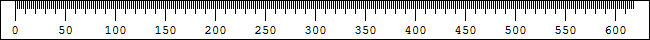

# User Interface {#ui}

The user interface consists of a single ruler that can be displayed either horizontally or vertically.

```{r, echo=FALSE, fig.cap="The ruler user interface."}

```

Holding down the primary mouse button on the ruler will allow you to drag the ruler around the screen.
Pressing the secondary mouse button on the ruler will display a context menu called the *Ruler Menu*.

If the mouse cursor moves past the right or bottom edge of the ruler, it will automatically extend.
The ruler will stay extended if the cursor is frozen or if a Guideline has been set beyond the default size.
Guidelines are covered in further detail in the [Guidelines](\#guidelines) section.

> The primary mouse button is determined by the *Select your primary button* option in the *Mouse Settings* in Microsoft Windows.
> Normally, it is the left mouse button.

## Rotating the ruler {#rotate}

The ruler can be rotated using the `Ctrl + Shift + Alt + R` key combination or by the `Ruler Menu → Rotate` menu item.
This is assignable to a mouse button click via the `Rotate` function.
It is not possible to have both a vertical and a horizontal ruler displayed at the same time.
When rotating the ruler, the axis changes but any [Guidelines](\#guidelines) are kept in the same position.

## Flipping the ruler {#flip}

```{r, echo=FALSE, fig.cap="The horizontal ruler flipped in both directions."}
knitr::include_graphics("images/ruler-flipped.png")
```

The hatch marks on the ruler can be flipped to be displayed on the opposite side of the ruler.
This is done by pressing the `Ctrl + Shift + Alt + E` key combination or by the `Ruler Menu → Flip Direction` menu item.
This is assignable to a mouse button click via the `Flip` function.

## Freezing the Cursor {#freeze}

You can freeze the cursor on the ruler so that it does not move with the mouse.
This is done by pressing the `Ctrl + Shift + Alt + F` key combination.

## Exiting the software {#exit}

Exit the software by pressing the `Ctrl + Shift + Alt + X` key combination or via the `Ruler Menu → Exit` menu item.

## Accessing this help {#help}

You can access this help guide by pressing `F1` when the ruler is focused or vua the `Ruler Menu → Help` menu item.