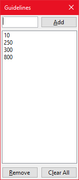

# Guidelines {#guidelines}

Guidelines allow you to mark specific points on the ruler.
These points can then be *locked on to* with the mouse and allow you to move the mouse along the locked axis.

## Adding and Removing Guidelines

Add and remove Guidelines by using the `Ruler Menu → Guidelines`submenu or via the *Guidelines* dialog.
Adding a Guideline will add a new guideline at the current cursor position on the ruler.
Removing a Guideline will remove the nearest guideline to the current cursor position.

> Both these functions can be assigned to a mouse button. 

## Clearing Guidelines

All the Guidelines can be cleared by using the `Ruler Menu → Guidelines → Clear All` submenu or via the *Guidelines* dialog.
Guidelines are also cleared before Import.

## Locking to Guidelines


## Importing and Exporting Guidelines

You can import and export Guidelines by using the `Ruler Menu → Guidelines → Import` or the `Ruler Menu → Guidelines → Export` submenus or via the *Guidelines* dialog.
Either of these options will display a File dialog so that you can select the file to load or save.

> Importing Guidelines will overwrite any existing Guidelines on the ruler.

### Guideline File Format

Guidelines can be exported to/imported from a simple text file.
The file contains a list of numbers which denote the Guideline pixel position on the ruler.
These files have no preferred extension.

```
20
100
150
620
```

## Guideline dialog

```{r, echo=FALSE, fig.cap="The Guideline dialog."}

```

The Guideline dialog can be accessed via the `Ruler Menu → Guidelines → Edit Guidelines` submenu.
This Dialog accepts manual input of Guideline positions and can remove specific Guidelines from the list or clear all Guidelines.