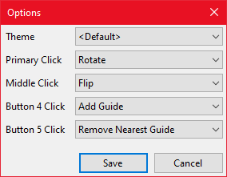

# Configuration {#config}

You can access the configuration by secondary clicking the ruler and selecting *Options*.
This will then display the *Options window* where you can change the configuration.

```{r, echo=FALSE, out.width="100%", fig.cap="The options window."}

```

## Options

### Theme

Allows you to change the [theme](\#themes) of the ruler.

### Mouse button clicks

Allows you to assign mouse button clicking the ruler to specific functionality.
Supports the Primary, Middle, Button 4, and Button 5 mouse buttons.
The following functions are assignable:

* None *Do nothing for the mouse button.*
* Rotate *Rotates the ruler.*
* Flip *Flips the ruler.*
* Add Guide *Adds a guideline to the ruler.*
* Toggle Guide *Toggles the guideline at the current cursor position.*
* Remove Nearest Guide *Removes the nearest guideline to the cursor.*
* Remove All Guides *Removes all guidelines.*
* Lock to Nearest Guide *Locks the mouse to the nearest guideline to the cursor.*

## Location

Configuration is stored in two locations depending on if you installed from the installer or from the chocolatey package.

Installer: \%appdata\%\\screenpixelruler\\app.cfg  
Chocolatey: \%chocolateyinstall\%\\lib\\screenpixelruler\\tools\\app.cfg  