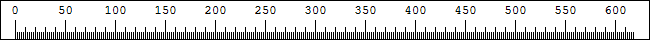
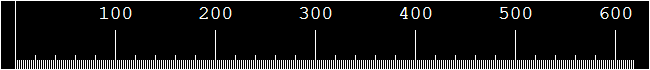
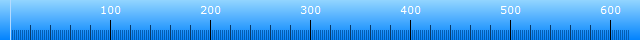
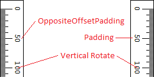

# Themes {#themes}

Themes can change the ruler colour, size or even the interval of the hatch marks.
Screen Pixel Ruler comes with some supplied themes.

## Supplied Themes

### System

```{r, echo=FALSE}

```

The built-in default theme for Screen Pixel Ruler.
This theme adjusts to your Windows 10/11 theme.
On older operating systems, the theme is black text on white, with red highlighting.

### Panda

```{r, echo=FALSE}

```

A high contrast theme with a thick ruler for easy visibility.

### MioPlanet PixelRuler

```{r, echo=FALSE}

```

A blue gradient ruled designed to mimic the look of the MioPlanet PixelRuler software.

### White Chocolate

A white on brown coloured theme.
Simple pallet swap of the Default theme.

## Location

Themes are stored in the two locations, depending on if you installed from the installer or from the chocolatey package.

Installer: \%appdata\%\\screenpixelruler  
Chocolatey: \%chocolateyinstall\%\\lib\\screenpixelruler\\tools  

## Creating a Theme

You can create your own themes for Screen Pixel Ruler. 
Themes have a `thm` file extension and are written in [yaml](https://yaml.org).
Looking at the existing themes can help you understand how to create your own.

### Objects

Below are objects and explainations of them that can be used in the theme file.

`<string>` A string of text.

`<boolean>` Either `true` or `false`.

`<decimal>` A decimal number like `1.0` or `1.5`.

`<number>` A number like `1` or `15`.

`<array>` An array of objects.

`<align>` Text alignment.
Supported values are:
- `Near`/`0` Align text to the left/top
- `Center`/`1` Align text to the center
- `Far`/`2` Align text to the right/bottom

`<colour>` A colour value.
Supported input types are:
- `'#RRGGBB'` Hex/HTML Colour
- `RRR, GGG, BBB` Decimal (0-255)
- `ColorName` Name

`<colours>` An array of either one (`[ <colour> ]`) or two colour values (`[ <colour>, <colour> ]`).
If two colours are provided then the colour will be a gradient.

> For a list of colour names see the [KnownColor Enum](https://docs.microsoft.com/en-us/dotnet/api/system.drawing.knowncolor?view=netcore-3.1) reference. 

### File Format

The rendering order of the elements are `Background ← Border ← Hatch Marks ← Guidelines ← Cursor`.

#### Fields

```
Name: <string> The name of the theme.
Cursor: Cursor themeing.
  Line: <colour> The cursor line colour.
  Font: The font used for the cursor.
    Family: <string> The font family.
    Size: <decimal> The font size.
    Bold: <boolean> Whether the font is bold.
    Italic: <boolean> Whether the font is italicised.
    Underline: <boolean> Whether the font is underlined.
    Strikeout: <boolean> Whether the font is striked out.
  Background: <colours> The background colours for the cursor.
  Frozen: The frozen colours for the cursor.
    Line: <colour> The frozen line colour.
    Font: The font used for the frozen cursor.
      Family: <string> The font family.
      Size: <decimal> The font size.
      Bold: <boolean> Whether the font is bold.
      Italic: <boolean> Whether the font is italicised.
      Underline: <boolean> Whether the font is underlined.
      Strikeout: <boolean> Whether the font is striked out.
    Background: <colours> The frozen background colours.
  Locked: The guideline locked colours for the cursor.
    Line: <colour> The locked line colour.
    Font: The font used for the locked cursor.
      Family: <string> The font family.
      Size: <decimal> The font size.
      Bold: <boolean> Whether the font is bold.
      Italic: <boolean> Whether the font is italicised.
      Underline: <boolean> Whether the font is underlined.
      Strikeout: <boolean> Whether the font is striked out.
    Background: <colours> The locked background colours.
Ruler: Ruler themeing.
  Size: <number> The size of the ruler in pixels.
  Background: <colours> The background colour for the ruler.
  Border:
    Colour: <colour> The border colour.
    Spacing: <number> The spacing between the border and the ruler.
  Marks: The hatch marks.
    Colour: <colour> The colour of the hatch marks.
    Size:
      Horizontal: <number> The size of the hatch marks when horizontal.
      Vertical: <number> The size of the hatch marks when vertical.
    Zero: The zero hatch mark.
        NumberVisible: <boolean> Whether the number zero is displayed.
        Size:
          Horizontal: <number> The size of the zero hatch mark when horizontal.
          Vertical: <number> The size of the zero hatch mark when vertical.
    Sizes: <array> The sizes of the hatch marks.
      Interval: <number> The interval of the hatch marks.
      Colour: <colour> The colour of the hatch marks.
      Size:
        Horizontal: <number> The size of the hatch marks when horizontal.
        Vertical: <number> The size of the hatch marks when vertical.
  Numbers: The numbers on the ruler.
    Padding: Padding from the nearest edge to the numbers.
      Horizontal: <number> Padding when ruler is Horizontal.
      Vertical: <number> Padding when ruler is Vertical.
    OppositeOffsetPadding: Additional padding when the ruler hatch marks a flipped.
      Horizontal: <number> Padding when ruler is Horizontal.
      Vertical: <number> Padding when ruler is Vertical.
    Offset: Adds additional padding from the cursor background to the number.
      Horizontal: <number> Offset when ruler is Horizontal.
      Vertical: <number> Offset when ruler is Vertical.
    Colour: <colour> The colour of the numbers.
    Font: The font used for the numbers.
      Family: <string> The font family.
      Size: <decimal> The font size.
      Bold: <boolean> Whether the font is bold.
      Italic: <boolean> Whether the font is italicised.
      Underline: <boolean> Whether the font is underlined.
      Strikeout: <boolean> Whether the font is striked out.
    Display:
      Interval: <number> The interval at which numbers should appear.
      Vertical: Settings for when the ruler is vertical.
        Rotate: <boolean> Whether the numbers should be rotated by 90 degrees.
        Alignment: <align> How the numbers should be aligned.
      Horizontal: Settings for when the ruler is horizontal.
        Rotate: <boolean> Whether the numbers should be rotated by 90 degrees.
        Alignment: <align> How the numbers should be aligned.
  Guidelines:
    Guideline: The guidelines.
      Colour: <colour> The colour of the guidelines.
      Size:
        Horizontal: <number> The size of the guidelines when horizontal.
        Vertical: <number> The size of the guidelines when vertical.
    Locked: The guideline locked onto.
      Colour: <colour> The colour of the guideline that has been locked onto.
      Size:
        Horizontal: <number> The size of the guideline that has been locked onto when horizontal.
        Vertical: <number> The size of the guideline that has been locked onto when vertical.
    Nearest: The guideline nearest to the cursor.
      Colour: <colour> The colour of the nearest guideline.
      Size:
        Horizontal: <number> The size of the nearest guideline when horizontal.
        Vertical: <number> The size of the nearest guideline when vertical.
```

#### UI Theme Elements

This section helps explains the user interface theme elements.

```{r, echo=FALSE, fig.cap="The Ruler user interface with theme elements highlighted."}
knitr::include_graphics("images/ruler-theme.png")
```

Zero is the Zero Mark which is explained further below.

Numbers are configured in `Ruler → Number` secion.
The `Ruler → Number → Display → Interval` determines how often the numbers appear.
An interval of `50` means that numbers will appear at the 50th, 100th, 150th, etc hatch marks.
The other properties under `Ruler → Number` determine the font, colour and size of the numbers.

Cursor is explained further below.

Background is the background colour of the ruler.
This is set at `Ruler → Background` and can be a single colour or a gradient when two colours are provided.

```{r, echo=FALSE, fig.cap="The cursor that appears in the ruler."}
knitr::include_graphics("images/ruler-cursor.png")
```

The cursor is displayed at the position of the mouse cursor on screen, relative to the ruler.
If the cursor is to the far top or far left to the ruler, the it does not appear.

The above options are all configured in the `Cursor` section.
`Cursor → Frozen` is used when the cursor is [frozen](\#freezing-the-cursor).
`Cursor → Locked` is used when the cursor is [locked to a guideline](\#locking-to-guidelines).

*Offset* `Ruler → Cursor → Offset` is used to add additional padding between the cursor number and the cursor background square.
The padding is added to the top of the number unless the number is rotated, if rotated then it is added to the right side.

*Cursor Background* `Cursor → Background` is used to set the background colour of the cursor square.

*Cursor Line* `Cursor → Line` is used to set the colour of the line of the cursor.

```{r, echo=FALSE, fig.cap="The ruler hatch marks."}
knitr::include_graphics("images/ruler-hashmarks.png")
```

*Zero Mark* hatch mark is provided by the `Ruler → Marks → Zero → Size` property.
You can also set the `Ruler → Marks → Zero → NumberVisible` property to `false` to omit the 0 number.

Size interval 10 and Size Interval 50 hatch marks are provided by the `Ruler → Marks → Sizes` array.
Below is an example of a 50 pixel interval hatch mark:

```yaml
...
  Marks:
    Sizes:
      - Interval: 50
        Colour: #000000
        Size:
          Horizontal: 20
          Vertical: 40
...
```

*Marks Size* hatch marks are provided by the `Ruler → Marks → Size` properties.
The colour is provided by the `Ruler → Marks → Colour` property.
Every even pixel on the ruler will have a hatch mark provided by this value.
Set the size to `0` to omit the default hatch marks.

```{r, echo=FALSE, fig.cap="Vertical ruler."}

```
*Padding* from the `Ruler → Numbers → Padding` property, applies padding to the numbers from the nearest edge.

*Opposite Offset Padding* under the `Ruler → Numbers → OppositeOffsetPadding`) property is the additional padding that is applied when the ruler is flipped to the opposite default direction.
This is applied in addition to any padding that is applied via `Ruler → Numbers → Padding` property.

*Vertical Rotate* (the `Ruler → Numbers → Display → Vertical → Rotate` and `Ruler → Numbers → Display → Horizontal → Rotate` properties) rotates the numbers 90 degrees.

> Note: The direction of the rotated numbers cannot be changed.

#### Default Values

| Font
|     Family: `Courier New`
|     Size: `9`
|     Bold: `false`
|     Italic: `false`
|     Underline: `false`
|     Strikeout: `false`
|
| Cursor → Locked
|     Cursor → Frozen
|
| Cursor → Frozen
|     Cursor
|
| Ruler → Background
|      `White`
|
| Ruler → Marks → Zero → NumberVisible
|     `false`
|
| Ruler → Marks → Zero → Colour
|     Ruler → Marks → Colour
|         `Transparent`
|
| Ruler → Guidelines → Nearest
|     Ruler → Guidelines → Guideline
|
| Ruler → Guidelines → Locked
|     Ruler → Guidelines → Guideline
|
| Ruler → Guideline → Guideline → Size
|      Ruler → Size
|
| Ruler → Guideline → Guideline → Colour
|      Ruler → Marks → Colour
