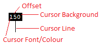

# Themes {#themes}

Themes can change the ruler colour, size or even the interval of the hatch marks.
Screen Pixel Ruler comes with some supplied themes.

## Supplied Themes

### Default

A simple black and white theme with a thin ruler. Great contrasting for easy visibility.

### Panda

A dark themed and large ruler.

### MioPlanet PixelRuler

A blue ruled designed to mimic the MioPlanet PixelRuler software.

### White Chocolate

A white on brown coloured theme.

## Location

Themes are stored in the two locations, depending on if you installed from the installer or from the chocolatey package.

Installer: \%appdata\%\\screenpixelruler  
Chocolatey: \%chocolateyinstall\%\\lib\\screenpixelruler\\tools  

## Creating a Theme

You can create your own themes for Screen Pixel Ruler. 
Themes have a `thm` file extension and are writtem in [yaml](https://yaml.org).

### Objects

<string> A string of text.

<boolean> Either `true` or `false`.

<decimal> A decimal number like `1.0` or `1.5`.

<number> A number like `1` or `15`.

<array> An array of objects.

<colour> A colour value.
Supported input types are:
- `'#RRGGBB'` Hex/HTML Colour
- `RRR, GGG, BBB` Decimal (0-255)
- `ColorName` Name

<colours> An array of either one (`[ <colour> ]`) or two colour values (`[ <colour>, <colour> ]`).
If two colours are provided then the colour will be a gradient of both colours.

> For a list of colour names see the [KnownColor Enum](https://docs.microsoft.com/en-us/dotnet/api/system.drawing.knowncolor?view=netcore-3.1) reference. 

### File Format

#### Fields

- Name <string> *The name of the theme.*
- Cursor *Cursor themeing.*
  - Line <colour> *The cursor line colour.*
  - Font *The font used for the cursor.*
    - Family <string> *The font family.*
    - Size <decimal> *The font size.*
    - Bold <boolean> *Whether the font is bold.*
    - Italic <boolean> *Whether the font is italicised.*
    - Underline <boolean> *Whether the font is underlined.*
    - Strikeout <boolean> *Whether the font is striked out.*
  - Background <colours> *The background colours for the cursor.*
  - Frozen *The frozen colours for the cursor.*
    - Line <colour> *The frozen line colour.*
    - Font *The font used for the frozen cursor.*
      - Family <string> *The font family.*
      - Size <decimal> *The font size.*
      - Bold <boolean> *Whether the font is bold.*
      - Italic <boolean> *Whether the font is italicised.*
      - Underline <boolean> *Whether the font is underlined.*
      - Strikeout <boolean> *Whether the font is striked out.*
    - Background <colours> *The frozen background colours.*
  - Locked *The guideline locked colours for the cursor.*
    - Line <colour> *The locked line colour.*
    - Font *The font used for the locked cursor.*
      - Family <string> *The font family.*
      - Size <decimal> *The font size.*
      - Bold <boolean> *Whether the font is bold.*
      - Italic <boolean> *Whether the font is italicised.*
      - Underline <boolean> *Whether the font is underlined.*
      - Strikeout <boolean> *Whether the font is striked out.*
    - Background <colours> *The locked background colours.*
- Ruler *Ruler themeing.*
  - Size <number> *The size of the ruler in pixels.*
  - Background <colours> *The background colour for the ruler.*
  - Border
    - Colour <colour> *The border colour.*
    - Spacing <number> *The spacing between the border and the ruler.*
  - Marks *The hatch marks.*
    - Colour <colour> *The colour of the hatch marks.*
    - Size
      - Horizontal <number> *The size of the hatch marks when the ruler is horizontal.*
      - Vertical <number> *The size of the hatch marks when the ruler is vertical.*
    - Zero *The zero hatch mark.*
        - NumberVisible <boolean> *Whether the number zero is displayed.*
        - Size
          - Horizontal <number> *The size of the zero hatch mark when the ruler is horizontal.*
          - Vertical <number> *The size of the zero hatch mark when the ruler is vertical.*
    - Sizes <array> *The sizes of the hatch marks.*
      - Interval <number> *The interval of the hatch marks.*
      - Colour <colour> *The colour of the hatch marks.*
      - Size
        - Horizontal <number> *The size of the hatch marks when the ruler is horizontal.*
        - Vertical <number> *The size of the hatch marks when the ruler is vertical.*
  - Numbers *The numbers on the ruler.*
    - Padding
      - Horizontal <number> *The padding on the left and right of the numbers.*
      - Vertical <number> *The padding on the top and bottom of the numbers.*
    - Colour <colour> *The colour of the numbers.*
    - Font *The font used for the numbers.*
      - Family <string> *The font family.*
      - Size <decimal> *The font size.*
      - Bold <boolean> *Whether the font is bold.*
      - Italic <boolean> *Whether the font is italicised.*
      - Underline <boolean> *Whether the font is underlined.*
      - Strikeout <boolean> *Whether the font is striked out.*
    - Display
      - Interval <number> *The interval at which numbers should appear.*
  - Guidelines
    - Guideline *The guidelines.*
      - Colour <colour> *The colour of the guidelines.*
      - Size
        - Horizontal <number> *The size of the guidelines when the ruler is horizontal.*
        - Vertical <number> *The size of the guidelines when the ruler is vertical.*
    - Locked *The guideline locked onto.
      - Colour <colour> *The colour of the guideline that has been locked onto.*
      - Size
        - Horizontal <number> *The size of the guideline that has been locked onto when the ruler is horizontal.*
        - Vertical <number> *The size of the guideline that has been locked onto when the ruler is vertical.*
    - Nearest *The guideline nearest to the cursor.*
      - Colour <colour> *The colour of the nearest guideline.*
      - Size
        - Horizontal <number> *The size of the nearest guideline when the ruler is horizontal.*
        - Vertical <number> *The size of the nearest guideline when the ruler is vertical.*

#### Visual Guide

```{r, echo=FALSE, fig.cap="The Ruler user interface with theme elements highlighted."}
knitr::include_graphics("images/ruler-theme.png")
```

*Zero* is the *Zero Mark* which is explained further below.

*Numbers* are configured in `Ruler → Number` secion.
The `Ruler → Number → Display → Interval` determines how often the numbers appear.
An interval of `50` means that numbers will appear at the 50th, 100th, 150th, etc hatch marks.
The other properties under `Ruler → Number` determine the font, colour and size of the numbers.

*Cursor* is the position of the mouse cursor on screen.
Fruther explaination below.

*Background* is the background colour of the ruler.
This is set at `Ruler → Background` and can be a single colour or a gradient when two colours are provided.

```{r, echo=FALSE, fig.cap="The cursor that appears in the ruler."}

```

The above options are all configured in the `Ruler → Cursor` section.

```{r, echo=FALSE, fig.cap="The ruler hatch marks."}
knitr::include_graphics("images/ruler-hashmarks.png")
```

*Zero Mark* hatch mark is provided by the `Ruler → Marks → Zero → Size` property.
You can also set the `Ruler → Marks → Zero → NumberVisible` property to `false` to omit the 0 number.

*Size interval 10* and *Size Interval 50* hatch marks are provided by the `Ruler → Marks → Sizes` array.
The 50 pixel interval hatch mark:

```yaml
...
  Marks:
    Sizes:
      - Interval: 50
        Colour: #000000
        Size:
          Horizontal: 20
          Vertical: 40
...
```

*Marks Size* hatch marks are provided by the `Ruler → Marks → Size` properties.
The colour is provided by the `Ruler → Marks → Colour` property.

#### Default Values

Font:
    Family: Courier New
    Size: 9
    Bold: false
    Italic: false
    Underline: false
    Strikeout: false

Cursor → Locked:
    Cursor → Frozen

Cursor → Frozen:
    Cursor

